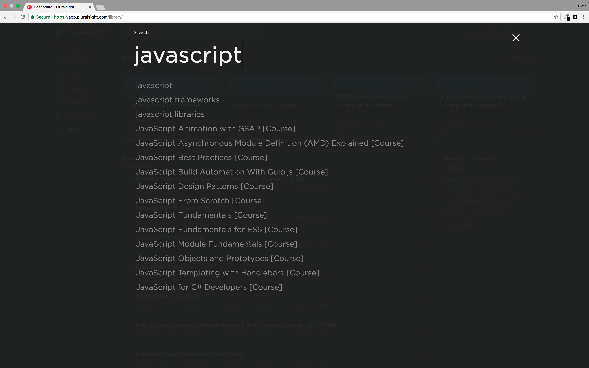

# week4-ammp


A clone of Pluralsight.com search engine
Live version: http://ammp.herokuapp.com/

## User Story



As a user I can start typing in the input box and:
- results will be overlayed in full screen
- I can see updated results and I continue typing
- results page can be closed by clicking on the 'x' button


The spectacular ammp autocompletion engine
We started out with a simple plan to create a front end web page which makes a call to a back end server with a few assets which it serves as well as sending a query (the user's input) to this back end which it searches through and returns a matching string.


## Sanitizing the front and back end
In order to prevent undesirable input such as javascript functions being passed into our input or unexpected special characters we filtered these out of our front end using the replace string method with a regular expression(RegExp).

```javascript
var desiredString = stringToReplace.replace(/[^\w\s]/gi, '');
```
This RegExp sets up a whitelist of permitted characters and replaces those that are not with an empty string. The whitespace ( `\w` ) & underscores ( `\s` ) are included in our safe list.

By removing these unwanted characters from the search we filter out characters that are not going to match our stored data and prevent tampering. We also repeat a similar pattern in our back end on the (*highly unlikely*) event that our data was tampered with onroute to the back end.

```javascript
// Extract the search query from the request url
const searchQuery = url.parse(request.url, true).query.search;

// Remove all non-letters
const searchQuerySanitized = searchQuery.replace(/[^a-z]/gi, '');
```

## Performance of generating an array using `filter`, `match`, `exec`

```javascript
// Option 1: filter
const wordsArr = file.slice(0, -1).split('\n');
const matchingWordArr = wordsArr.filter(word => {
  const pattern = new RegExp(searchQuerySanitized, 'i');
  return pattern.test(word);
});
// Time to get results: 200 ms

// Option 2: match
const pattern = new RegExp(`\\b.*${searchQuerySanitized}.*\\b`, 'gi');
const matchingWordArr = file.match(pattern) || [];
// Time to get results: 50 ms

// Option 3: exec
function getMatchingWordArr(searchQuerySanitized, file) {
  const pattern = new RegExp(`\\b.*${searchQuerySanitized}.*\\b`, 'gi');

  const matchingWordArr = [];

  let match;
  let numberOfMatches = 0;

  while ((match = pattern.exec(file)) !== null && numberOfMatches < 100) {
    matchingWordArr.push(match[0]);
    numberOfMatches++;
  }

  return matchingWordArr;
}
// Time to get results: 10 ms
```
